# Phases of the project

## Background

## Loading and transformation of the initial Data tables.

## Creating the data model

I created a Dates table according to the first and last date of the Orders table:

The following is my Star Schema Data Model outlining the connections between different tables

I wrote DAX expressions to create key measures of the data, for example calculating revenue-to-date and Profit year-to-date:

## Building the Customer Detail Page

Here is the Customer Detail page with a range of interesting insights

The Date Slider allows the client to specify the years in which they want to look at, from which all the stats will automatically adjust accordingly.

The two cards at the top indicate the Total Customers and Revenue per Customer within the timeframe.

The 'total customers by start of the year' graph indicates a steady increase until a drop around 2022. There is a trend line showing the steady increase in customers over the years. I have also forecasted the next ten years and we can see that the amount of customers levels out and increases at a slower rate.

'Total Customers by Category' shows what categories are best performing, we can see that the three categories most popular among customers are 'homeware', 'toys and games' and 'food and drink'.

There is also a table, including data bars for the revenue per customer. From this we can see that Jade Harris had the most orders yet didn't have the highest personal revenue.

We use similar filters to find the top customer by revenue. The details include their full name, their personal revenue and the number of orders.

Finally, we have a donut visual displaying the distribution of customers by country.

## Creating an Executive Summary Page

Here is the Executive Summary page for C-Suite executives can quickly get insights and check outcomes against key outcomes:

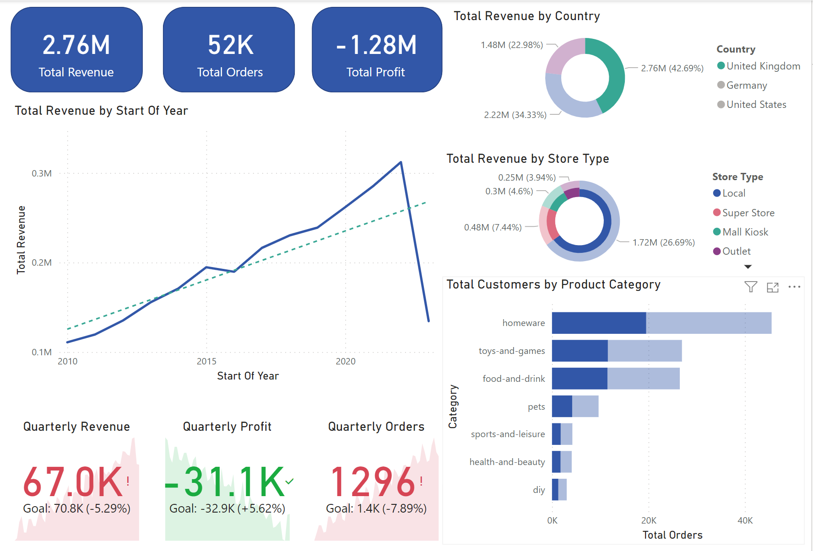

We have three key indicator cards on Total Revenue, Total Orders and Total Profit. From this we can see that the current total profit is a 1.28 million loss.

We also have a Total Revenue Chart that shows the change in Revenue over the years.

We also have key performance indicators on the previous quarterly Revenue, Profit and Orders. It shows the goals for Revenue, Profit and Orders and shows how far away the current values are from these goals.

The pair of donut visuals display the Total Revenue broken down by Country and Store Type. This shows that the United Kingdom provides the highest proprtion of Revenue and local store type provides the highest revenue.

Finally, we can see the total customers by product category. Clearly homeware is the best selling product category.

## Building a Product Detail Page

The purpose of the page is to provide an indepth look at which products in the inventory are performing well, with the option to filer by product and region.

Here is the Product Detail Page:

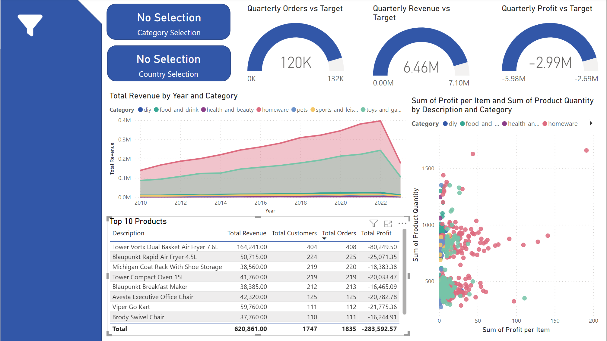

Here we have three gauge indicators showing how far away from the target Orders, Revenue and Profits for this quarter.

From these indicators we can see that the comany is 12k orders away from reaching the target set out by the CEO.

The Scatter graph indicated the sum of profit per item and sum of product quantity by description and category. The scatter graph is set up so that we can clearly see insights categories that contain high performing products and when hovering over the data point we can see the specific product name using the following:

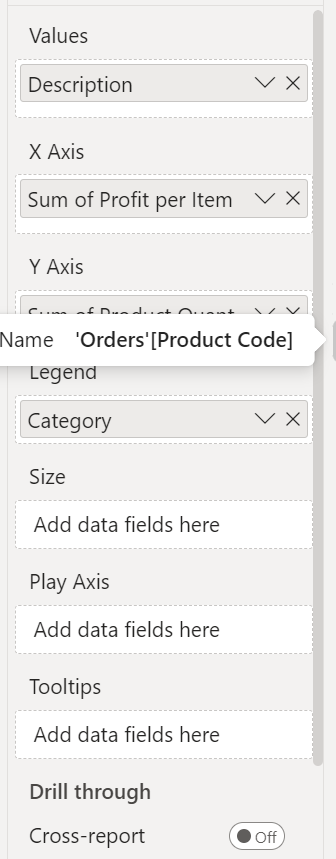

The Area chart indicated the total revenue by year and category.

The Table shows the top 10 performing products with information information on the Total Revenue, Total Customers, Total Orders and Total Profit.

Aditionally, we have a filter button:

That will open a slicer toolbar, where we can filter by Country and Product Category:

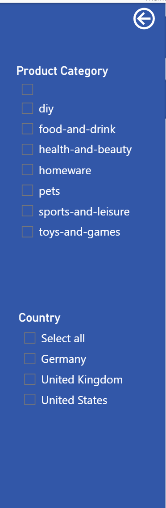

This information will be reflected on the page, for example the performance of food and drink in Germany:

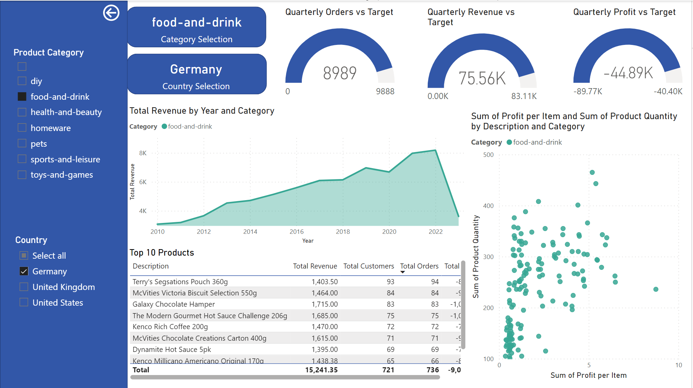

I assigned the back button to the slicer bar closed bookmark and I assigned the filter button to the slicer bar open bookmark:

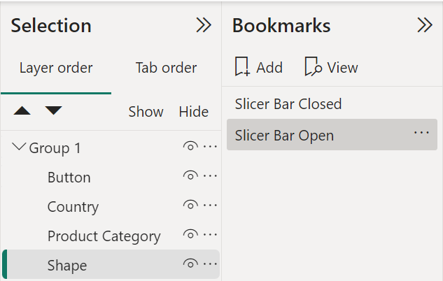

## Building the Stores Map Page

Additionally, we have a stores drillthrough page, including the top 5 products table, total orders by category bar chart, two gauges for profit YTD vs the target profit compared to a 20% increase from a year ago, and we have the same metric for Revenue. We also have a card that shows the selection of category.

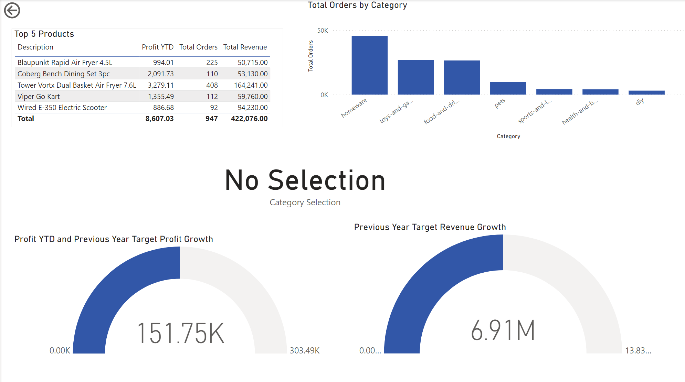

For the gauge visuals, I created and used the following Measures:

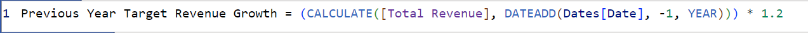

We have a stores map page that shows all the stores worldwide in a scrollable map where each store has a bubble size dependent on the profit ytd:

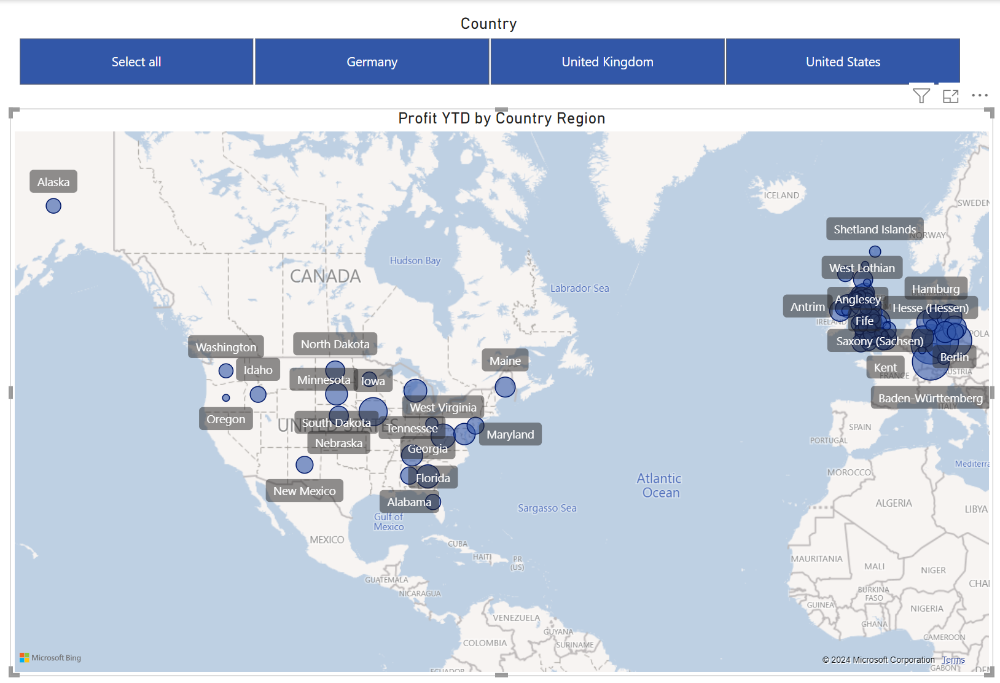

An added feature to the map was that scrolling over a specific store will give us the profit year-to-date for that specific store to allow regional managers to easily check the stores under their control. In the example we can see that the Greater London Profit Year to Date is £916.83:

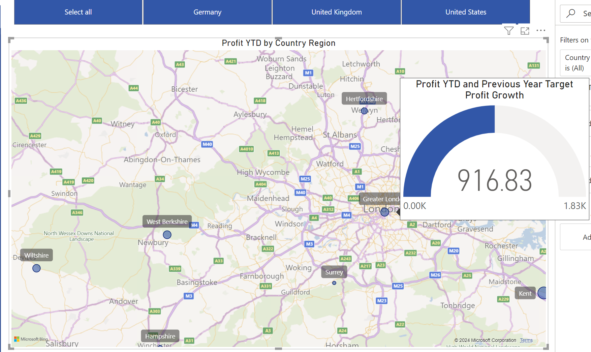

I used a specific custom tooltip year-to-date page:

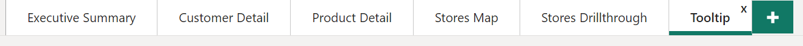

## Cross Filtering and Navigation

At this step of the project, I managed the interactions between the visuals such that some visuals would affect others and some would not:

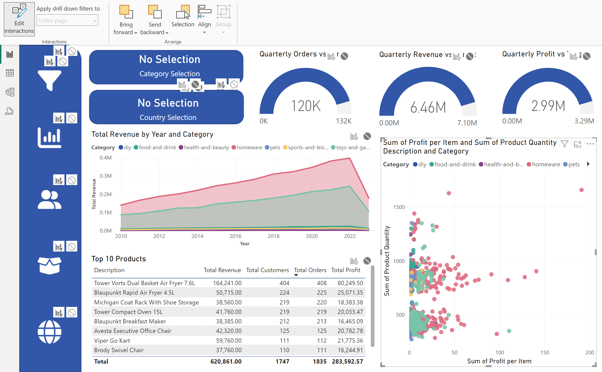

Additionally I created a navigation bar that changes colour when hovered over, using the hover over style button. The Navigation Side Bar allows user to navigate the different pages:

## Creating Metrics for Users Outside the Company using SQL

Finally, I created a connection to the SQL server in VScode, then went on to write SQL queries to indicate check the table and Column Names:

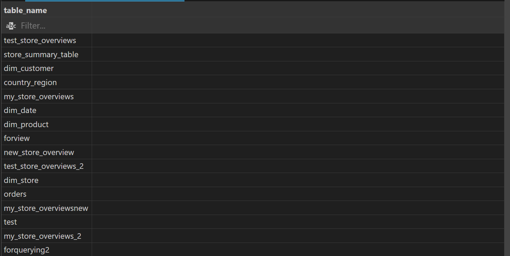

Then I queried the data using SQL to ensure that data insights can be accessed by a broader audience. Here's an example of answering the question "How many staff are there in all of the UK stores?":

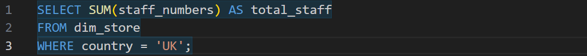

This SQL query outputted the following result:

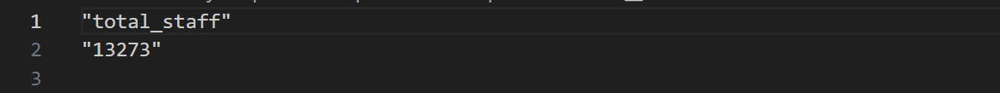

This was saved in a csv file.

## Summary

I learnt a lot from this project. I was able to fully explore all of Power BI's key features. It gave me experience in bringing odd datasets that a company had lying around and extracted, transformed and loaded the data to bring clear actionable insights. I was able to develop my comfort in using Power BI for an end-to-end project and look forward to applying these skills to further projects!
