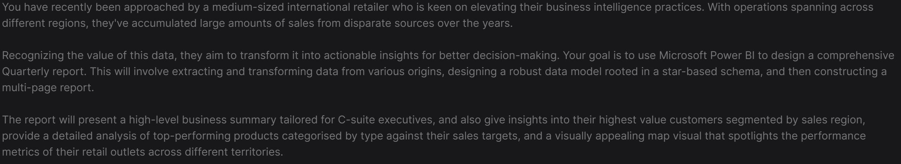
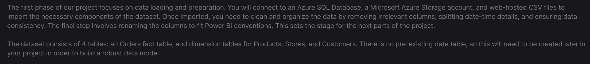
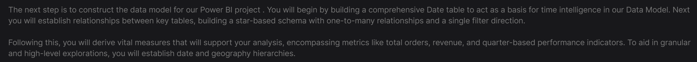
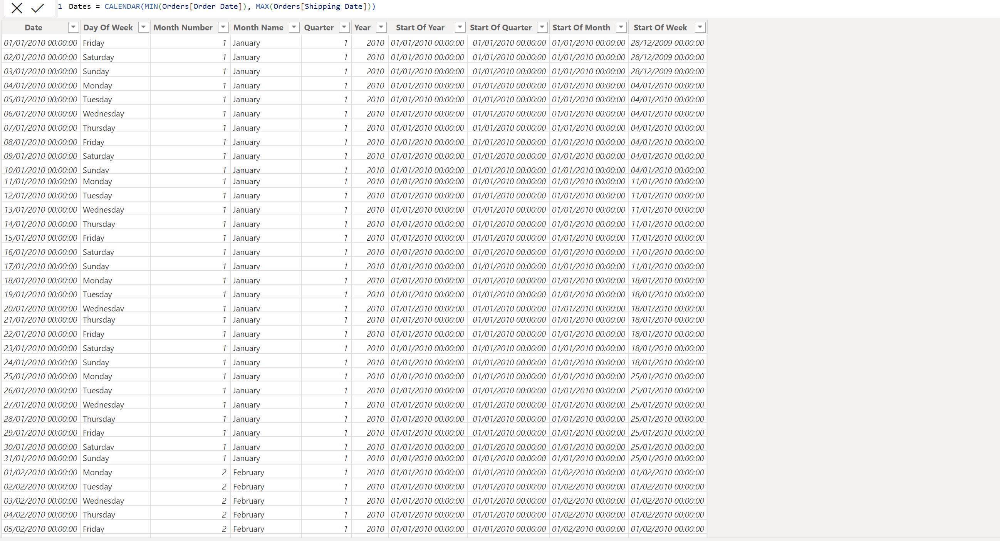
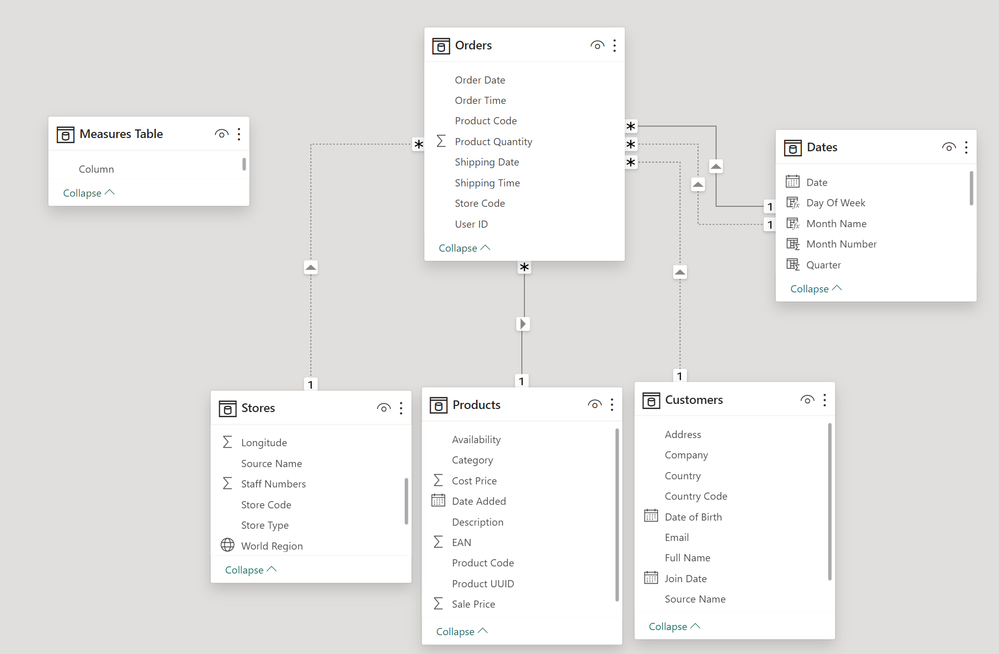
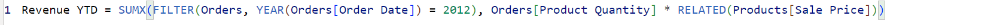
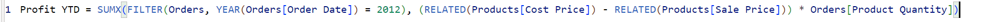
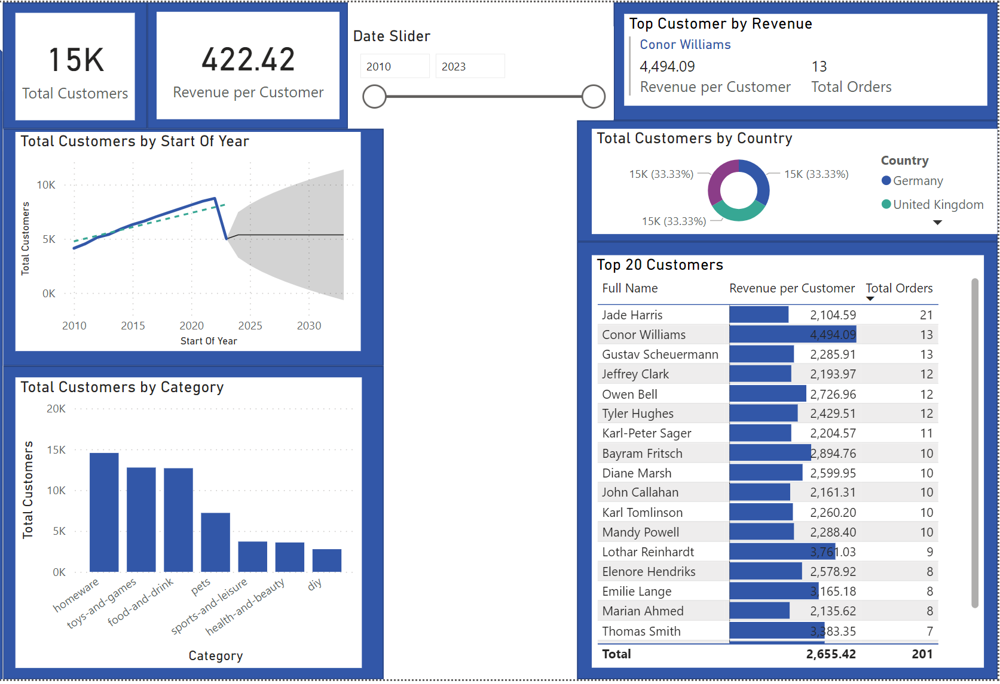

# Phases of the project

## Background

## Loading and transformation of the initial Data tables.

## Creating the data model

I created a Dates table according to the first and last date of the Orders table:

The following is my Star Schema Data Model outlining the connections between different tables

I wrote DAX expressions to create key measures of the data, for example calculating revenue-to-date and Profit year-to-date:

## Building the Customer Detail Page

Here is the Customer Detail page with a range of interesting insights

The Date Slider allows the client to specify the years in which they want to look at, from which all the stats will automatically adjust accordingly.

The two cards at the top indicate the Total Customers and Revenue per Customer within the timeframe.

The 'total customers by start of the year' graph indicates a steady increase until a drop around 2022. There is a trend line showing the steady increase in customers over the years. I have also forecasted the next ten years and we can see that the amount of customers levels out and increases at a slower rate.

'Total Customers by Category' shows what categories are best performing, we can see that the three categories most popular among customers are 'homeware', 'toys and games' and 'food and drink'.

There is also a table, including data bars for the revenue per customer. From this we can see that Jade Harris had the most orders yet didn't have the highest personal revenue.

We use similar filters to find the top customer by revenue. The details include their full name, their personal revenue and the number of orders.

Finally, we have a donut visual displaying the distribution of customers by country.